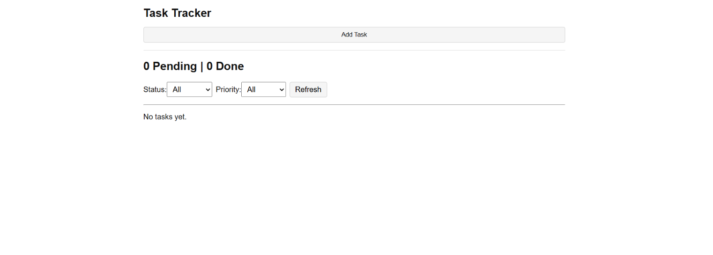
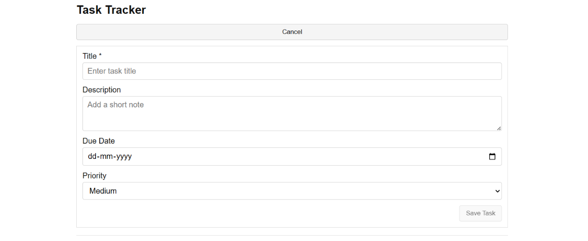
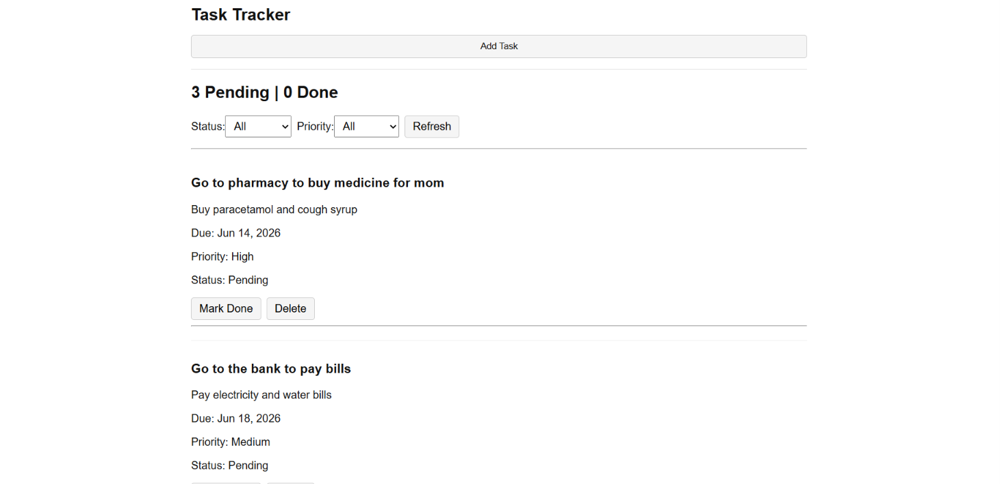

# Task Tracker

## Project Overview

Task Tracker is a simple web application that allows users to create, manage, update, and track daily tasks.

The application is built using:

* Angular 21 (Frontend)
* Node.js + Express (Backend REST API)
* PostgreSQL (Database)

The application supports task creation, task status management, filtering, and task deletion through a simple user interface.

---

## Features

### Task Management

* Add a new task
* View all tasks
* Update task status (Done / Pending)
* Delete tasks with confirmation
* Store tasks in PostgreSQL database

### Filtering

* Filter tasks by status:

  * All
  * Pending
  * Done

* Filter tasks by priority:

  * Low
  * Medium
  * High

### Dashboard Summary

* Displays task counts:

  * X Pending Tasks
  * Y Completed Tasks

### User Interface

* Simple and responsive layout
* Add Task button
* Task list sorted by due date
* Confirmation before deleting tasks

---

## Technology Stack

### Frontend

* Angular 21
* TypeScript
* HTML
* CSS

### Backend

* Node.js
* Express.js

### Database

* PostgreSQL 18

### Tools

* Git
* GitHub
* Postman

---

## Database Schema

```sql
CREATE TABLE tasks (
    id SERIAL PRIMARY KEY,
    title VARCHAR(200) NOT NULL,
    description TEXT,
    due_date DATE,
    priority VARCHAR(10) NOT NULL
        CHECK(priority IN ('Low','Medium','High')),
    is_done BOOLEAN NOT NULL DEFAULT FALSE,
    created_at TIMESTAMP NOT NULL DEFAULT NOW()
);
```

---

## API Endpoints

### Get All Tasks

```http
GET /api/tasks
```

### Get Single Task

```http
GET /api/tasks/:id
```

### Create Task

```http
POST /api/tasks
```

### Update Task

```http
PUT /api/tasks/:id
```

### Delete Task

```http
DELETE /api/tasks/:id
```

---

## Project Structure

```text
task-tracker
│
├── backend
│   ├── routes
│   ├── db.js
│   └── server.js
│
├── database
│   ├── schema.sql
│   └── seed.sql
│
├── frontend
│   └── src
│       └── app
│           ├── components
│           ├── models
│           └── services
│
└── README.md
```

---

## Setup Instructions

### 1. Clone Repository

```bash
git clone <repository-url>
cd task-tracker
```

---

### 2. Database Setup

Create PostgreSQL database:

```sql
CREATE DATABASE tasktracker;
```

Run schema script:

```bash
psql -U postgres -d tasktracker -f database/schema.sql
```

Run seed script:

```bash
psql -U postgres -d tasktracker -f database/seed.sql
```

---

### 3. Backend Setup

Navigate to backend folder:

```bash
cd backend
```

Install dependencies:

```bash
npm install
```

Create `.env` file:

```env
DB_USER=postgres
DB_PASSWORD=your_password
DB_HOST=localhost
DB_PORT=5432
DB_NAME=tasktracker

PORT=3000
```

Start server:

```bash
node server.js
```

Server runs on:

```text
http://localhost:3000
```

---

### 4. Frontend Setup

Navigate to frontend folder:

```bash
cd frontend
```

Install dependencies:

```bash
npm install
```

Run Angular application:

```bash
ng serve
```

Application runs on:

```text
http://localhost:4200
```

---

## Screenshots

### Home Page



### Add Task



### Task List




### Filters


## Assumptions

* Single-user application.
* Authentication is not required.
* Tasks are sorted by due date.
* Priority values are restricted to Low, Medium, and High.
* PostgreSQL is running locally.

---

## Future Improvements

* Login.
* Search tasks.
* Edit task details.
* Deploy backend and frontend to cloud platforms.
* Improved Design.
* Optimize for mobile.

---

## Author

Joe Antony

Task Tracker
